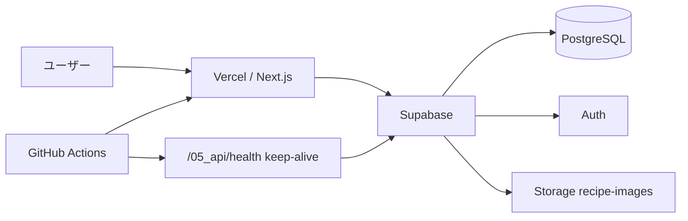

# システムコンテキスト

## 構成要素

| 要素 | 役割 |
| --- | --- |
| Vercel | 本番・Preview のホスティング（Production = `main`） |
| Supabase Cloud | DB・Auth・Storage（本番 / 検証プロジェクト） |
| GitHub Actions | CI（lint/test）、Supabase Free 向け keep-alive |

## 環境

| 環境 | Git | アプリ | DB |
| --- | --- | --- | --- |
| 本番 | `main` | Vercel Production | Supabase 本番 |
| 検証 | `develop` | Vercel Preview | 検証用プロジェクト（任意） |

手順は [development/deploy-vercel-supabase.md](../08_development/deploy-vercel-supabase.md) を参照してください。
