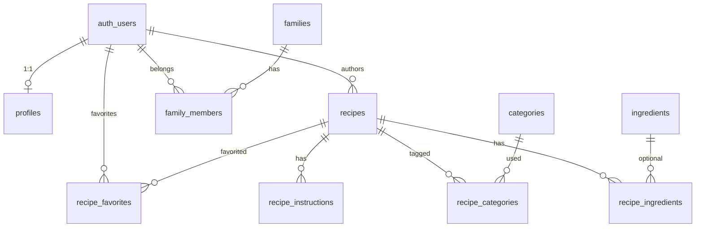

# ER 図

## 図（SVG）

## Mermaid（編集用）

`auth.users` は Supabase Auth 管理のため図では `auth_users` と表記。

## テーブル定義

[tables/README.md](./tables/README.md) に一覧。RLS の背景は [09_decisions/008-rls-helper-functions.md](../09_decisions/008-rls-helper-functions.md)。
