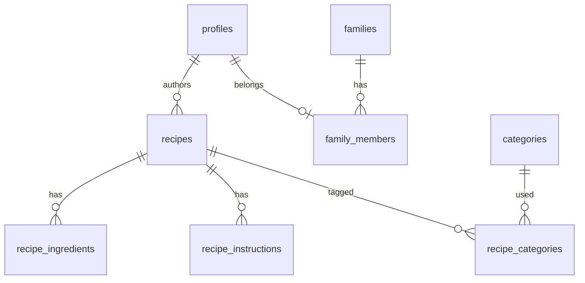

# ER / データモデル概要

テーブル定義の一覧は [tables/README.md](./tables/README.md) です。RLS とビューは [decisions/008-rls-helper-functions.md](../09_decisions/008-rls-helper-functions.md) を参照してください。

## 主要エンティティ（概念）

## 画像

レシピサムネイルは DB に **Storage パス** を保存し、表示時に署名 URL を発行します。詳細は [storage-security.md](./storage-security.md) と [database/images/](./images/)（図置き場）。
