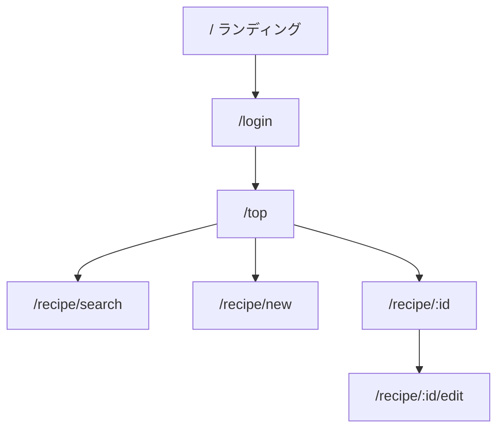

# 画面フロー

## 主要導線（概要）

未ログイン時は `src/proxy.ts` により保護ルートは `/login` へリダイレクトします（`/api/health` など例外あり）。

## 画面設計書

| 画面 | ドキュメント |
| --- | --- |
| ゲストログイン | [screens/guest-login.md](./screens/guest-login.md) |
| レシピ検索 | [screens/recipe-search.md](./screens/recipe-search.md) |
| キーワード検索 | [screens/recipe-search-keyword.md](./screens/recipe-search-keyword.md) |
