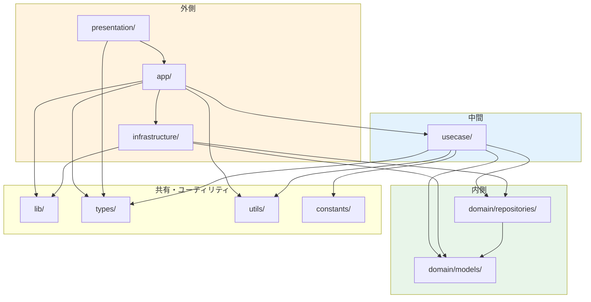
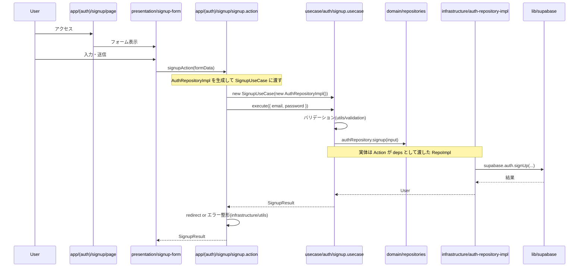
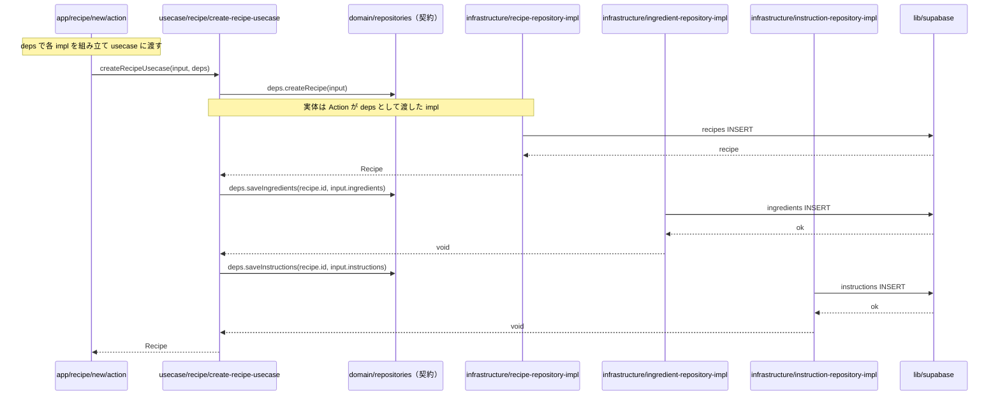
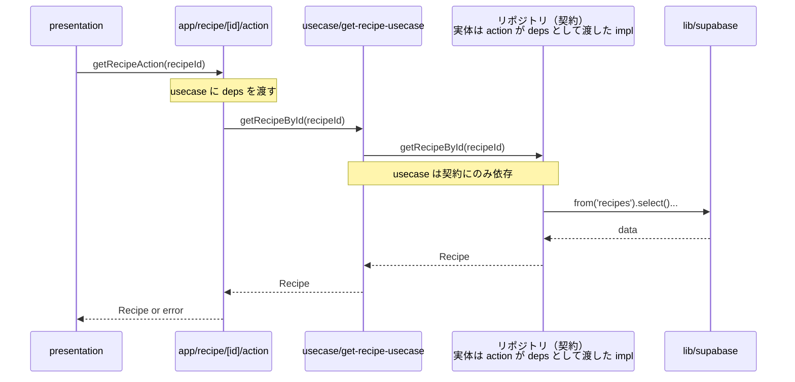
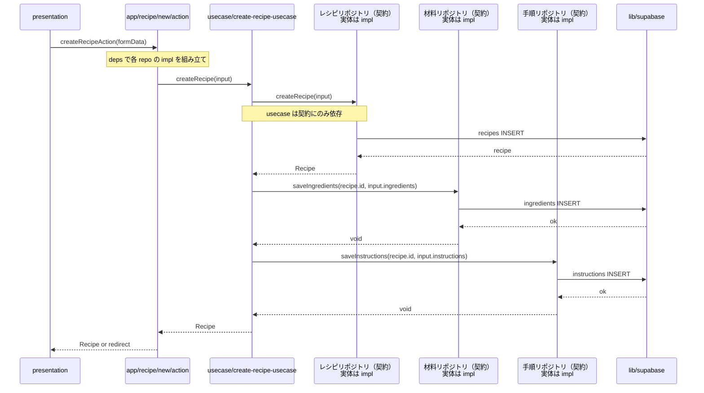
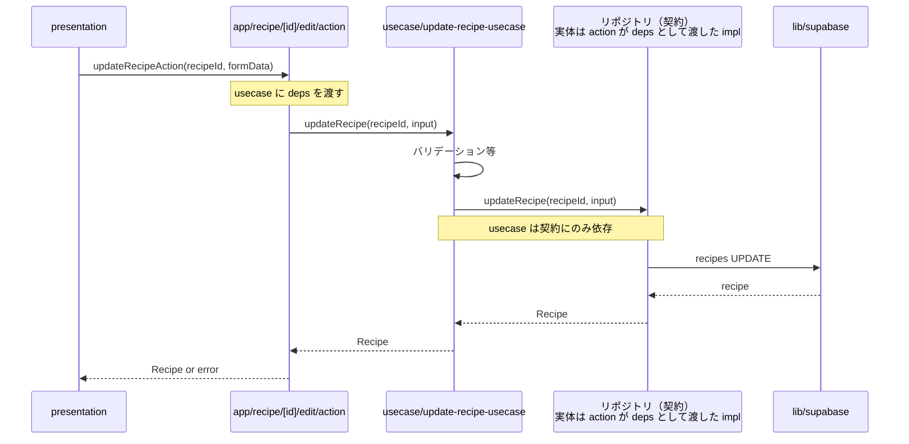
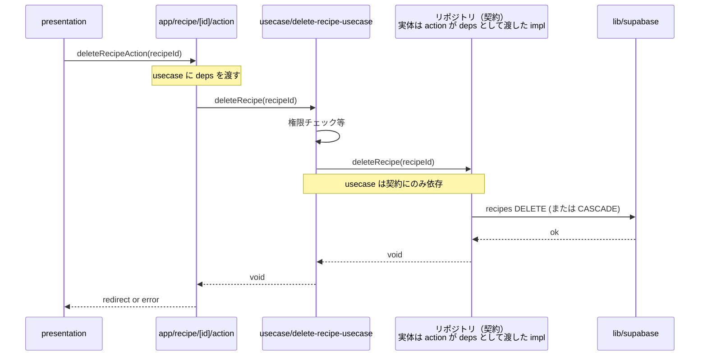

# クリーンアーキテクチャとディレクトリ構成

このドキュメントでは、本プロジェクトが採用しているクリーンアーキテクチャの考え方と、`src/` 以下のディレクトリ構成・**何をどこで呼ぶか**を図で整理する。

---

## 0. このドキュメントを読む前に（はじめてクリーンアーキテクチャを触る方へ）

### クリーンアーキテクチャって何？

一言でいうと「**変更に強いコードの設計パターン**」です。

アプリを作っていると、こんな問題が起きがちです。

- DB を Supabase から別のものに変えたら、画面のコードも直さないといけなかった
- ちょっとした機能を直そうとしたら、関係ないファイルまで変更が広がった
- テストを書こうとしたら、DB や外部 API なしでは動かないコードになっていた

これらの問題の根っこは「**どの層からどの層を呼んでもよい**」という暗黙のルールがないことです。  
クリーンアーキテクチャは「誰が誰を呼んでよいか（依存してよいか）」のルールを決めることで、この問題を防ぎます。

### 基本ルールは 1 つだけ

> **内側の層は外側の層を知ってはいけない。**

```
[外側] app → usecase → domain [内側]
              依存の向き（外→内のみ）
```

- **内側**（`domain`）… ビジネスのルール（「レシピには必ず材料が必要」など）。変わりにくい
- **外側**（`app`, `infrastructure`）… DB・UI・フレームワークなどの「道具」。取り替えることがある

道具は取り替えることがありますが、ビジネスのルールは変わりにくい。  
だから**ルール（内側）は道具（外側）を知らないでおく**と、道具を取り替えてもルール側を触らなくて済みます。

### 各層を料理に例えると（このアプリはレシピアプリなので！）

| 層 | 料理の例え | このプロジェクト |
|---|----------|--------------|
| `domain/models` | メニューの定義（「ラーメンとは何か」） | `Recipe`, `Ingredient` などの型 |
| `domain/repositories` | 発注書の書式（「食材をこう調達してください」という約束） | リポジトリのインターフェース |
| `infrastructure` | 実際の仕入れ先・調達方法（Supabase） | リポジトリの実装 |
| `usecase` | 調理手順（食材を組み合わせて料理を作る工程） | 機能のオーケストレーション |
| `app` | ウェイター（お客さんの注文を受け取り、厨房に伝える） | Server Actions・ページ |
| `presentation` | フロアスタッフ（お客さんと直接やりとりする） | UI コンポーネント |

### よく出てくる言葉の補足

| 言葉 | 意味 |
|-----|-----|
| **インターフェース（契約）** | 「こういうことができる何かを用意してください」という TypeScript の型定義。実装は持たない |
| **依存する（依存している）** | `import` していること。`import { X } from '...'` と書いたら依存している状態 |
| **依存性の逆転** | 普通は「usecase が infrastructure を使う」が、インターフェースを挟むことで「infrastructure が usecase の要求する形に合わせる」と逆転させるパターン |
| **オーケストレーション** | 複数の処理を指揮者のように組み合わせて、1 つの機能を作ること（usecase の役割） |
| **deps（依存）** | usecase が必要とする操作（リポジトリの実装関数など）をオブジェクトにまとめたもの。app 層で組み立てて渡す |

---

## 1. クリーンアーキテクチャの前提

### 1.1 依存の向き（依存性のルール）

**依存は常に内側向き**である。

- 外側の層は内側の層を「呼ぶ」「import する」ことができる。
- **内側の層は外側の層を import してはいけない。**

```
    外側 ──────────────────────────────────────────
           │
           │  依存してよい（外→内）
           ▼
    内側 ──────────────────────────────────────────
```

内側ほど「ビジネスルールやドメイン」に近く、外側ほど「DB・API・UI」に近い。  
内側が外側に依存すると、技術の差し替えやテストがしづらくなるため、このルールを守る。

### 1.2 本プロジェクトでの層の対応（外側 → 内側）

| 層（外側→内側） | 役割 | 本プロジェクトのディレクトリ |
|------------------|------|-----------------------------|
| フレームワーク・ドライバ | UI、HTTP、DB クライアント | Next.js（App Router）、`src/lib/`（Supabase 等） |
| インターフェースアダプタ | UI と usecase の橋渡し、永続化の**実装** | `src/app/`, `src/presentation/`, `src/infrastructure/` |
| アプリケーション（ユースケース） | アプリ固有のオーケストレーション | `src/usecase/` |
| エンティティ・ドメイン | ビジネスルール、型・契約 | `src/domain/`（`models/`, `repositories/` のインターフェース） |

- **domain** … 最内層。型・エンティティ・リポジトリの**インターフェース（契約）**のみ。  
- **usecase** … domain に依存。リポジトリは「インターフェース」にだけ依存し、**実装（infra）は import しない**。  
- **infrastructure** … domain のリポジトリ契約を**実装**する。Supabase 等を呼ぶ。  
- **app** … Server Actions やページ。usecase を呼び、必要なら **infra を組み立てて usecase に deps として渡す**。  
- **presentation** … UI コンポーネント。app の Action 等を呼ぶ。

---

## 2. ディレクトリ構成と「何をどこで呼ぶか」

### 2.1 ディレクトリ一覧と責務

```
src/
├── app/                    # Next.js App Router（ルーティング・Server Actions）
├── presentation/          # UI コンポーネント
├── usecase/                # ユースケース（オーケストレーション）
├── domain/                 # ドメイン層
│   ├── models/             # エンティティ・値オブジェクト（型）
│   └── repositories/      # リポジトリのインターフェースと入出力型
├── infrastructure/         # 永続化・外部サービスの実装
│   ├── repositories/      # リポジトリの実装（Supabase 等）
│   └── utils/              # インフラ寄りのユーティリティ
├── lib/                    # 外部クライアントのラッパー（Supabase 等）
├── types/                  # アプリ全体で使う型（Result 型など）
├── utils/                  # プレーンなユーティリティ（バリデーション等）
└── constants/              # 定数（エラーメッセージ等）
```

### 2.2 依存関係の図（誰が誰を import してよいか）



- **domain** … 他層やフレームワークに依存しない（`domain/repositories` → `domain/models` のみ可）。  
- **usecase** … domain と types/utils/constants に依存。**infrastructure は import しない**（契約だけに依存し、実装は app から deps として渡す）。  
- **infrastructure** … domain と lib に依存。  
- **presentation** … app と types に加え、**`@/lib/utils`（`cn` など純 UI 用）** だけ `lib` を import してよい。Supabase 等の `@/lib` は app 経由。  
- **app** … usecase / infrastructure / lib 等を組み合わせ、**「誰を誰に渡すか」を決める**層。

---

## 3. 処理の流れ（何をどこで呼ぶか）

### 3.1 認証フロー（サインアップ）— app 層で impl を渡すパターン

usecase はリポジトリの**インターフェース**だけに依存し、**実装は app 層で組み立てて渡す**。



- **app（Action）** … Action 内で `AuthRepositoryImpl` を生成し、`SignupUseCase` のコンストラクタに渡す。usecase は「契約」だけを知っている。  
- **usecase** … `AuthRepository` の**型（契約）**だけを知っており、`signup(input)` を呼ぶ。infra を import していない。  
- **infrastructure** … `AuthRepository` を実装し、`lib/supabase` を呼ぶ。

### 3.2 レシピ作成フロー — deps パターンの呼び出し関係

`create-recipe-usecase.ts` は**関数の引数で deps を受け取る**形で実装されており、usecase は infrastructure を直接 import しない。  
app 層が各リポジトリの実装を deps オブジェクトにまとめて usecase に渡す。



- **app（Action）** … 各リポジトリの実装（`createRecipe`, `saveIngredients`, `saveInstructions`）を deps にまとめて `createRecipeUsecase` に渡す。  
- **usecase** … `deps.createRecipe` / `deps.saveIngredients` / `deps.saveInstructions` という**関数の型（契約）**だけを知っており、infra を import しない。  
- **infrastructure** … 各リポジトリ実装関数が INSERT を実行。これらは action が deps として渡している。

### 3.3 一覧：どこから何を呼ぶか

| 呼び出す側 | 呼んでもよいもの | 呼んではいけないもの |
|------------|------------------|------------------------|
| **app/** | usecase, infrastructure, lib, types, utils | （最外層のため制限は主に「ビジネスロジックを書かない」など） |
| **presentation/** | app（Action 等）, types, **`@/lib/utils`**（`cn` 等） | usecase, infrastructure、その他の **`@/lib`**、domain の**値 import**（**`import type` のみ可**） |
| **usecase/** | domain/models, domain/repositories（インターフェースのみ）, types, utils, constants | infrastructure（実装）, app, presentation |
| **infrastructure/** | domain/models, domain/repositories, lib | usecase, app, presentation |
| **domain/repositories/** | domain/models, 同ディレクトリ内の型 | 上記以外のすべて（infra, usecase, app, lib 等） |
| **domain/models/** | 同ディレクトリ内の型のみ | 上記以外のすべて |

---

## 4. CRUD サンプルケース

CRUD の呼び出しは **参照（Read）** と **作成・更新・削除（CUD）** でパターンが分かれる。

- **参照** … 1 本の流れで「リポジトリの get/find を呼んで返す」だけ。副作用がない。
- **作成・更新・削除** … リポジトリの create / update / save / delete を呼び、データを変更する。作成は複数リポジトリを順に呼ぶケースがある。

**図について（依存関係の補足）**  
以下のシーケンス図では、usecase から「Repo」を呼ぶように描いているが、**usecase が依存しているのはリポジトリのインターフェース（契約）だけ**である。**impl（infrastructure の実装）は action が組み立てて usecase に渡す**ため、usecase は impl を import しない。図中で「実体は impl」と書いているのは「実行時に動くコードは infrastructure の実装」という意味で、**依存の向き**は usecase → domain の契約のみである。

以下はすべて **action → usecase → リポジトリ（インターフェース経由。実体は action が deps として渡した impl）** の形で、action は usecase だけを呼び出す前提で描いている。

### 4.1 参照（Read）— レシピ 1 件取得

**流れ**: presentation が action を呼ぶ → action が usecase を呼ぶ → usecase がリポジトリの `getRecipeById` を 1 回呼んで結果を返す。



- **action** … usecase を呼ぶ前に、リポジトリの**実装（impl）**を deps として組み立てて usecase に渡す。usecase は「契約」だけを知っている。
- **usecase** … `getRecipeById(recipeId)` を**リポジトリのインターフェース**に委譲する。impl は import しない。
- **infra** … リポジトリの**実装**が `getRecipeById` で Supabase から SELECT する。action がこの実装を deps として usecase に渡している。

一覧取得（`findRecipesByAuthorId` など）も同じパターンで、usecase がリポジトリの find 系を 1 回呼んで返す。

---

### 4.2 作成（Create）— レシピ作成

**流れ**: 親エンティティ（レシピ）を作成したあと、子（材料・手順）を保存するなど、**複数リポジトリを順に呼ぶ**。



- **action** … usecase に「createRecipe 用の deps」（各リポジトリの**実装**）を渡してから `createRecipe(input)` を呼ぶ。usecase は契約だけに依存する。
- **usecase** … 1) createRecipe、2) saveIngredients、3) saveInstructions の順で**リポジトリのインターフェース**を呼ぶ。impl は import しない。
- **infra** … 各リポジトリの実装が INSERT を実行。これらは action が deps として usecase に渡している。

---

### 4.3 更新（Update）— レシピ更新

**流れ**: リポジトリの `updateRecipe` を 1 回呼ぶ。子（材料・手順）を「全削除してから再挿入」する場合は、usecase 内で `saveIngredients` / `saveInstructions` を追加で呼ぶパターンになる。



- **action** … usecase に deps としてリポジトリの**実装**を渡してから `updateRecipe` を呼ぶ。
- **usecase** … 必要ならバリデーションをしたあと、**リポジトリのインターフェース**の `updateRecipe` に委譲。impl には依存しない。
- **infra** … `updateRecipe` の実装で UPDATE を実行。

---

### 4.4 削除（Delete）— レシピ削除

**流れ**: リポジトリの `deleteRecipe`（または `deleteRecipeById`）を 1 回呼ぶ。関連データを先に消す必要がある場合は、usecase 内で子用の delete を先に呼ぶ。



- **action** … usecase に deps としてリポジトリの**実装**を渡してから `deleteRecipe` を呼ぶ。
- **usecase** … 権限や削除可能条件を確認したあと、**リポジトリのインターフェース**の `deleteRecipe` に委譲。impl には依存しない。
- **infra** … `deleteRecipe` の実装で DELETE を実行（関連テーブルは CASCADE または usecase で明示的に delete を呼ぶ）。

---

### 4.5 CRUD 別の整理

| 操作 | 呼び出しの特徴 | リポジトリの例 |
|------|----------------|----------------|
| **参照（R）** | usecase が get/find を 1 回呼んで返す | `getRecipeById`, `findRecipesByAuthorId` |
| **作成（C）** | usecase が create のあと save 系を順に呼ぶことがある | `createRecipe` → `saveIngredients` → `saveInstructions` |
| **更新（U）** | usecase が update を 1 回（必要なら save を追加） | `updateRecipe`, 必要に応じて `saveIngredients` 等 |
| **削除（D）** | usecase が delete を 1 回（関連があれば先に子を delete） | `deleteRecipe`, `deleteIngredientsByRecipeId` 等 |

---

## 5. まとめ

- **依存の向き** … 内側（domain）は外側に依存しない。usecase は domain と「契約」にだけ依存し、**infrastructure は import しない**（実装は app 層で deps として渡す）。  
- **何をどこで呼ぶか** … 上記の図と表を基準にすると、「この処理はどの層に書くか」「この層からあの層を import してよいか」の判断がしやすい。  
- **認証** … app 層で impl を生成してコンストラクタに渡し、「usecase → インターフェースのみ」の依存を守る。  
- **レシピ作成** … usecase が deps（関数の型）を引数で受け取り、app 層で各 impl を deps として渡す形で実装済み。

各ディレクトリの詳細なルールは、次の README を参照すること。

- `src/domain/models/_README.md`
- `src/domain/repositories/_README.md`
- `src/usecase/_README.md`
- `src/infrastructure/repositories/_README.md`
